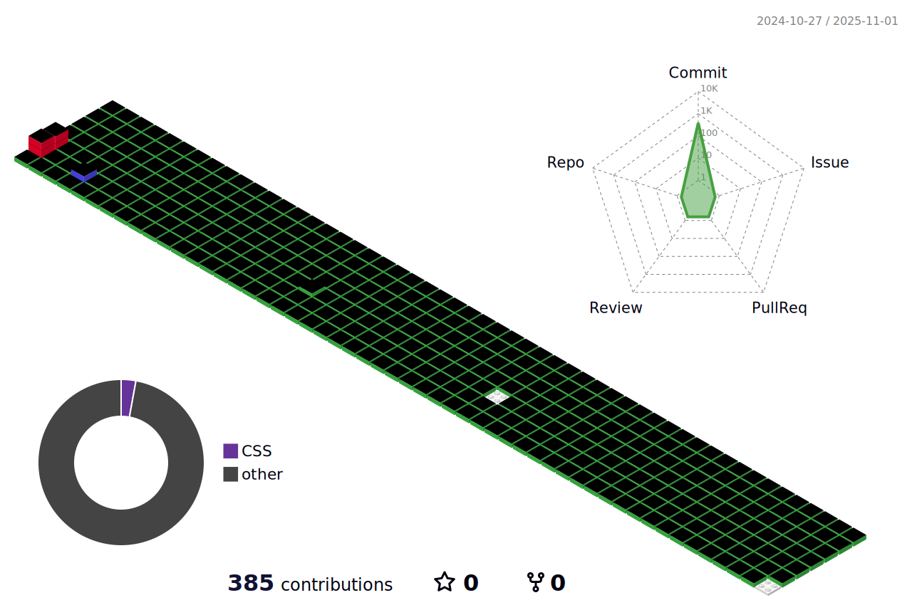

  <a href="README_en.md">English</a>

 

<h1 align="center">👋 소개 및 목표</h1>

  안녕하세요! 저는 주영준입니다. 소프트웨어 개발을 공부하는 학생입니다. 다양한 기술 스택을 배우고 있으며, 백엔드 개발, 서버 관리 및 윤리적 해킹에 관심이 많습니다. 안정적이고 확장 가능한 소프트웨어를 개발하는 것이 목표입니다.
   
   
  앞으로 오픈 소스 프로젝트에 기여하고 더 많은 사람들에게 도움이 되는 소프트웨어를 만드는 것이 꿈입니다. 항상 새로운 기술을 배우고 성장하는 개발자가 되기 위해 노력하고 있습니다.

 

  <h1>📚 스택(공부중인거)</h1>
  
  
   
  
  
  
   
  
   
  
  
   
  
  
   
  
  
  

 

  <h1>📚 도구</h1>
  
  
  
  
  
  

 

  <h1>📚 관심사</h1>
  
  
  
  
  
  
  
  
  
   
  
  
  
  
  
  
  

 

  <h1>GitHub 통계</h1>
  

    
    
    
  

 

  <h1>📫 연락처</h1>
  
  
  

 

  

 

  <h1>🌟 프로젝트</h1>
  
<a href="https://github.com/JuYoungJun/Mini_Project">Mini Project</a> - 자바 GUI로 만든 간단한 복권 프로그램입니다.

  
<a href="https://github.com/JuYoungJun/TeamProject">TeamProject</a> - 팀프로젝트입니다.

 

  <h1>🌟 레포지토리</h1>
  
<a href="https://github.com/JuYoungJun/Java">Java Repository</a> - Java 공부를 게시한 레포지토리입니다!

  
<a href="https://github.com/JuYoungJun/Html">HTML Repository</a> - HTML 공부를 게시한 레포지토리입니다!

  
<a href="https://github.com/JuYoungJun/Spring">Spring Repository</a> - Spring 공부를 게시한 레포지토리입니다!

  
<a href="https://github.com/JuYoungJun/programmers">Programmers Repository</a> - Programmers 문제 해결 코드를 게시한 레포지토리입니다!

 

  <h1>🌟 테스트 레포지토리</h1>
  
<a href="https://github.com/JuYoungJun/test">test</a>

  
<a href="https://github.com/JuYoungJun/studey2">studey2</a>

  
<a href="https://github.com/JuYoungJun/mission">mission</a>

  
<a href="https://github.com/JuYoungJun/prmission2">mission2</a>

  
<a href="https://github.com/JuYoungJun/mission4">mission4</a>

  
<a href="https://github.com/JuYoungJun/Parsing-test">Parsing-test</a>

